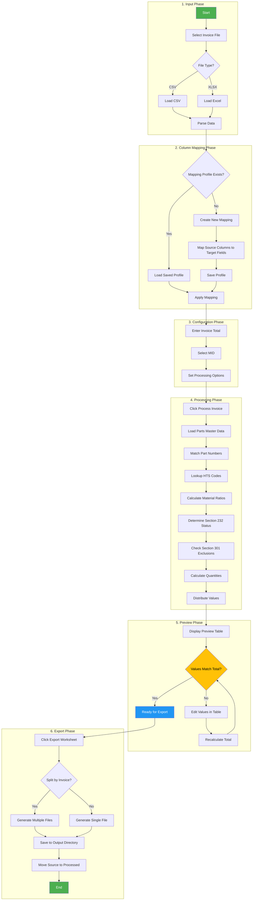

# Invoice Processing Workflow

This flowchart shows the complete invoice processing workflow from file upload to export.

## Process Steps

### 1. Input Phase
- User selects a CSV or XLSX invoice file
- System parses the file and loads data into memory

### 2. Column Mapping Phase
- If a saved mapping profile exists for this invoice format, it's loaded automatically
- Otherwise, user creates a new mapping to match source columns to target fields
- Mappings can be saved for reuse with similar invoices

### 3. Configuration Phase
- User enters the commercial invoice total
- Selects the appropriate MID (Manufacturer ID)
- Sets any additional processing options

### 4. Processing Phase
- System looks up each part number in the Parts Master database
- Retrieves HTS codes, material ratios, and country of origin data
- Calculates Section 232 tariff status based on material content
- Checks for Section 301 exclusions
- Calculates CBP quantities (Qty1, Qty2)
- Distributes values proportionally

### 5. Preview Phase
- Results displayed in editable preview table
- Color-coded rows indicate material classification
- User can edit values directly in the table
- System validates that line values match invoice total

### 6. Export Phase
- Generate CBP-compliant Excel worksheet
- Option to split output by invoice number
- Source files moved to Processed folder
