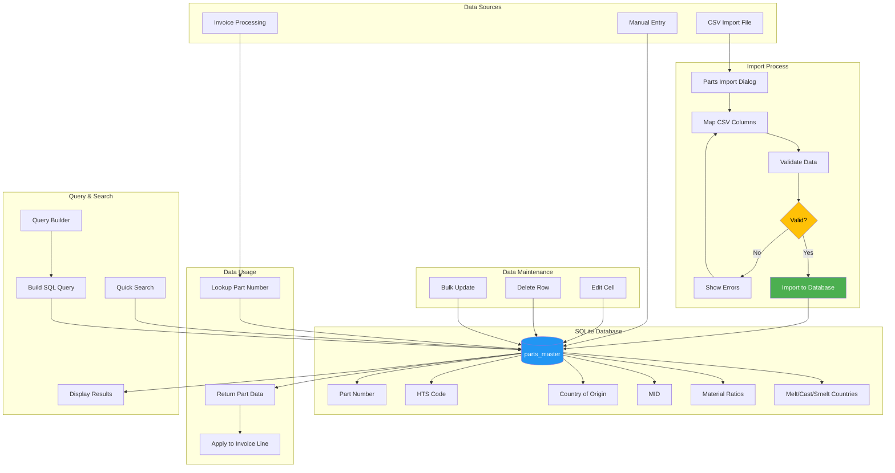

# Parts Master Data Flow

This flowchart shows how parts data is managed, imported, and used throughout the application.

## Data Structure

### Parts Master Table Fields
| Field | Description | Used For |
|-------|-------------|----------|
| part_number | Unique part identifier | Primary lookup key |
| hts_code | Harmonized Tariff Schedule code | Duty calculation |
| country_of_origin | Country where product originated | CBP declaration |
| mid | Manufacturer ID | Customs identification |
| steel_ratio | Percentage of steel content | Section 232 |
| aluminum_ratio | Percentage of aluminum content | Section 232 |
| copper_ratio | Percentage of copper content | Section 232 |
| wood_ratio | Percentage of wood content | Section 232 |
| auto_ratio | Percentage classified as automotive | Section 232 |
| country_of_melt | Steel melt country | Section 232 declaration |
| country_of_cast | Steel cast country | Section 232 declaration |
| prim_country_of_smelt | Primary smelt country | Section 232 declaration |

## Import Process

1. **Select CSV File** - Choose a CSV file containing parts data
2. **Map Columns** - Match CSV columns to database fields
3. **Validate** - Check for required fields and data format
4. **Preview** - Review data before import
5. **Import** - Insert or update records in database

## Query Builder

The Query Builder allows complex searches:
- Multiple conditions (AND/OR)
- Field comparisons (equals, contains, starts with)
- Numeric ranges
- Export results to CSV
