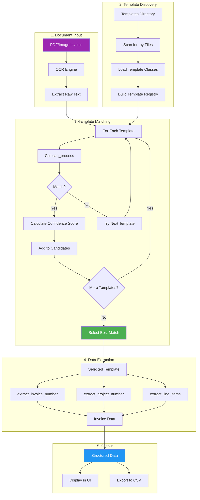

# PDF Processing Template System

This flowchart shows how the PDF Processing tab processes invoices using the template system.



## Template System Architecture

### Template Discovery
```
templates/
├── __init__.py          # Dynamic discovery logic
├── base_template.py     # Base class for all templates
├── sample_template.py   # Example template (excluded)
├── bill_of_lading.py    # Bill of Lading template
├── mmcite_brazilian.py  # Brazilian supplier template
├── mmcite_czech.py      # Czech supplier template
└── lacey_act_form.py    # PPQ Form 505 template
```

### Template Interface

Each template must implement:

```python
class MyTemplate(BaseTemplate):
    name = "Template Name"
    description = "Template description"
    client = "Client/Vendor name"
    version = "1.0.0"
    enabled = True

    def can_process(self, text: str) -> bool:
        """Check if this template can process the text"""
        pass

    def get_confidence_score(self, text: str) -> float:
        """Return 0.0-1.0 confidence score"""
        pass

    def extract_invoice_number(self, text: str) -> str:
        """Extract invoice number from text"""
        pass

    def extract_line_items(self, text: str) -> List[Dict]:
        """Extract line items from text"""
        pass
```

## Matching Algorithm

1. **Load All Templates** - Scan templates directory for Python files
2. **Filter Enabled** - Only consider templates with `enabled = True`
3. **Test Each Template** - Call `can_process()` on extracted text
4. **Score Matches** - Calculate confidence scores for matching templates
5. **Select Best** - Choose template with highest confidence score

## Hot Reload

Templates support hot reload:
- Call `refresh_templates()` to rescan directory
- New templates are automatically discovered
- Modified templates are reloaded
- Deleted templates are removed from registry
