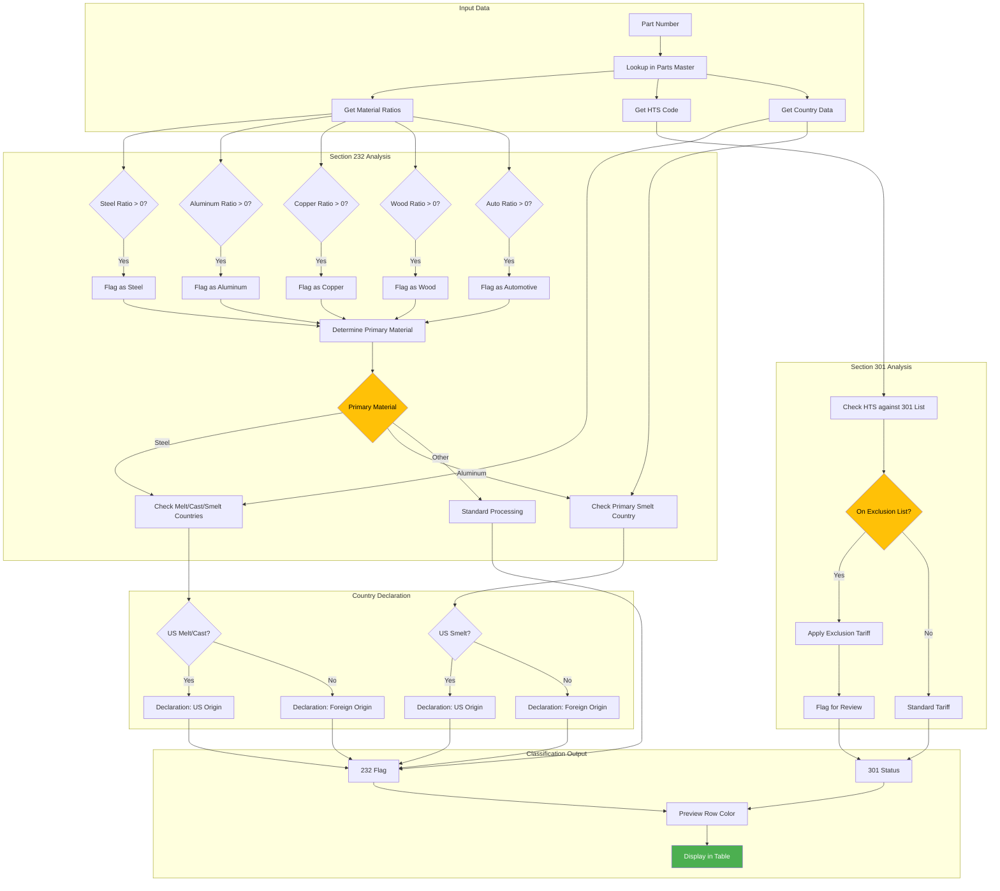

# Section 232/301 Tariff Detection

This flowchart shows how TariffMill determines Section 232 and Section 301 tariff classifications.



## Section 232 Steel/Aluminum Tariffs

### Material Classification
| Material | Tariff Rate | Declaration Required |
|----------|-------------|---------------------|
| Steel | 25% | Melt, Cast, Smelt countries |
| Aluminum | 10% | Primary smelt country |
| Copper | Varies | Country of origin |
| Wood | Varies | Country of harvest |
| Automotive | Varies | USMCA compliance |

### Country Declaration Logic

**Steel Products:**
```
If steel_ratio > 0:
    Require: country_of_melt, country_of_cast, prim_country_of_smelt
    Declaration Flag based on US vs Foreign origin
```

**Aluminum Products:**
```
If aluminum_ratio > 0:
    Require: prim_country_of_smelt
    Declaration Flag based on US vs Foreign origin
```

## Section 301 Exclusions

### Exclusion Check Process
1. Extract HTS code from part data
2. Compare against Section 301 exclusion list
3. If match found, apply exclusion tariff rate
4. Flag row for special handling in export

### Visual Indicators

| Color | Meaning |
|-------|---------|
| Blue | Steel product |
| Green | Aluminum product |
| Orange | Copper product |
| Brown | Wood product |
| Purple | Automotive product |
| Red Border | Section 301 exclusion |
| Gray | No special classification |

## Processing Flow

1. **Load Part Data** - Retrieve all material ratios from database
2. **Calculate Percentages** - Determine material composition
3. **Identify Primary Material** - Find highest ratio material
4. **Check Country Data** - Verify melt/cast/smelt declarations
5. **Apply 232 Rules** - Determine tariff applicability
6. **Check 301 List** - Compare HTS against exclusion list
7. **Set Display Colors** - Apply visual indicators
8. **Generate Declarations** - Create required declaration text
