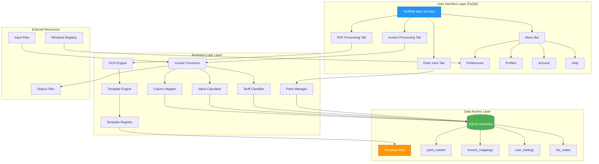
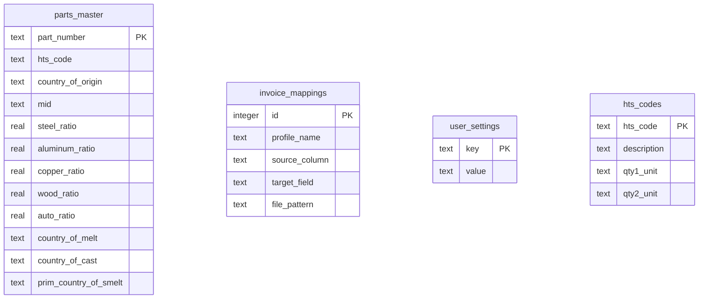

# Application Architecture

This flowchart shows the overall system architecture and component relationships.



## Component Overview

### User Interface Layer

| Component | Description |
|-----------|-------------|
| Main Window | Primary application window with tabbed interface |
| Invoice Processing | Invoice processing and export functionality (CSV/Excel files) |
| PDF Processing | OCR processing with AI template system for PDF invoices |
| Parts View | Database management for parts inventory |
| Menu Bar | Preferences, Profiles, Account, and Help menus |

### Business Logic Layer

| Component | Description |
|-----------|-------------|
| Invoice Processor | Core invoice processing engine |
| Parts Manager | CRUD operations for parts database |
| OCR Engine | Text extraction from PDF/images |
| Column Mapper | Map source columns to target fields |
| Value Calculator | Calculate quantities and distributions |
| Tariff Classifier | Determine Section 232/301 status |
| Template Engine | Match and apply OCR templates |

### Data Access Layer

| Component | Description |
|-----------|-------------|
| SQLite Database | Primary data storage |
| Template Files | Python template definitions |
| Windows Registry | User-specific preferences |

## Database Schema



## File Structure

```
Tariffmill/
├── tariffmill.py           # Main application
├── version.py              # Version management
├── Resources/
│   ├── tariffmill.db       # SQLite database
│   ├── icon.ico            # Application icon
│   └── References/
│       ├── hts.db          # HTS code reference database
│       └── CBP_232_tariffs.xlsx
├── templates/
│   ├── __init__.py         # Template discovery
│   ├── base_template.py    # Base template class
│   └── *.py                # Custom templates
├── Input/
│   └── Processed/          # Archived input files
└── Output/
    └── Processed/          # Archived output files
```

## Technology Stack

| Technology | Purpose |
|------------|---------|
| Python 3.12 | Core language |
| PyQt5 | Desktop GUI framework |
| Pandas | Data processing and manipulation |
| SQLite | Embedded database |
| OpenPyXL | Excel file read/write |
| pdfminer | PDF text extraction |
| Anthropic Claude | AI-powered template generation |
| PyInstaller | Executable packaging |
| Inno Setup | Windows installer |
