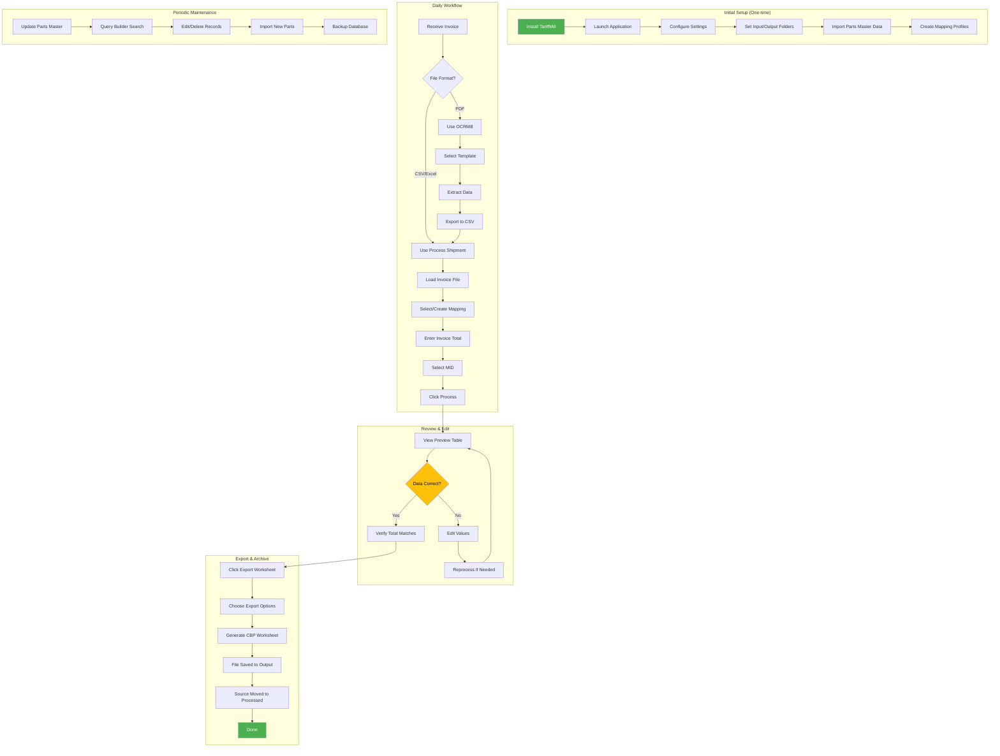
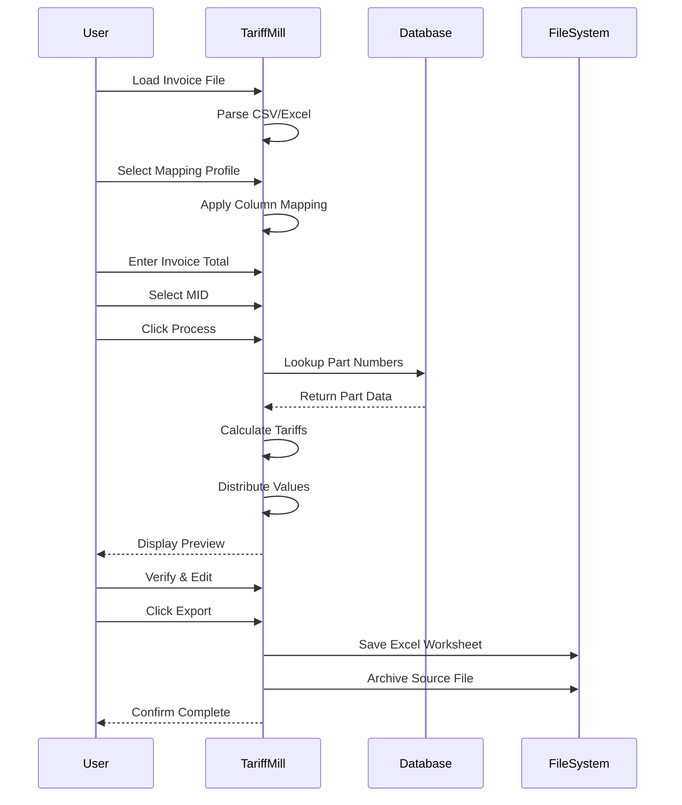

# User Workflow

This flowchart shows the end-to-end user journey for processing customs documentation.

## Detailed User Steps

### Initial Setup

1. **Install Application**
   - Run TariffMill_Setup.exe installer
   - Or use standalone TariffMill.exe

2. **Configure Settings**
   - Settings → Settings
   - Set input folder (where invoices are stored)
   - Set output folder (where exports are saved)
   - Choose theme (Light/Dark)

3. **Import Parts Data**
   - Parts Master tab → Import
   - Select CSV file with parts data
   - Map columns to database fields
   - Import records

4. **Create Mapping Profiles**
   - Process first invoice from each supplier
   - Create mapping for that invoice format
   - Save profile for future use

### Daily Invoice Processing

### Quick Reference

| Task | Location | Steps |
|------|----------|-------|
| Process Invoice | Process Shipment tab | Load → Map → Process → Export |
| Add New Part | Parts Master tab | Right-click → Add Row |
| Edit Part | Parts Master tab | Double-click cell |
| Search Parts | Parts Master tab | Use search box or Query Builder |
| Import Parts | Parts Master tab | File → Import |
| Change Theme | Settings menu | Select Light/Dark |
| View Logs | Log View menu | View Log |

### Keyboard Shortcuts

| Shortcut | Action |
|----------|--------|
| Ctrl+O | Open invoice file |
| Ctrl+S | Save/Export |
| Ctrl+P | Process invoice |
| Ctrl+F | Search parts |
| Ctrl+R | Refresh/Reprocess |
| F5 | Refresh file lists |

### Troubleshooting Common Issues

| Issue | Solution |
|-------|----------|
| Part not found | Add to Parts Master database |
| Values don't match | Edit in preview table |
| Wrong HTS code | Update in Parts Master |
| Missing MID | Add to MID list in Configuration |
| Export fails | Check output folder permissions |
